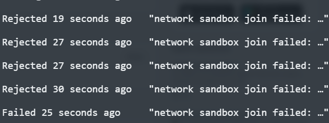

## Using snap package manager install version 1.19 microk8s
sudo snap install microk8s --classic --channel=1.19

## Join the group
MicroK8s creates a group to enable seamless usage of commands which require admin privilege. To add your current user to the group and gain access to the .kube caching directory, run the following two commands
```
sudo usermod -a -G microk8s $USER
sudo chown -f -R $USER ~/.kube
```
### Should re-enter the user session
```
su - $USER
```

## Check the status
```
microk8s status --wait-ready
```

## Access kubernetes cluster
```
microk8s kubectl get nodes
microk8s kubectl get services
```
### You can set alias for kubectl in ~/.bashrc
```
kubectl='microk8s kubectl'
```

## You can list snap installed package with below command
```
snap list
```
## If want remove microk8s , please check below steps
```
microk8s.reset
sudo snap remove microk8s
```
### Remove tutorial reference
[install microk8s](https://microk8s.io/)   
[snap remove microk8s](https://codefresh.io/kubernetes-tutorial/local-kubernetes-linux-minikube-vs-microk8s/)   
[snap remove microk8s issue on github](https://github.com/ubuntu/microk8s/issues/58)

### github reference
[microk8s github](https://github.com/ubuntu/microk8s)

## 這邊簡單紀錄一下我後續發生的故事
#### 因為內部最後還是決定使用 swarm 部署，所以我將本地的 microk8s 刪除。結果我開始用 swarm 就發生 network 問題


#### 解法參考
[網址](https://success.mirantis.com/article/error-network-sandbox-join-failed-during-service-restarts)

##### 所以我照上面的做了
```
ls -l /sys/class/net/ | grep vx
udevadm info /sys/class/net/<vxlanid>
sudo ip -d link show vx-000000-xxxxx
sudo ip link delete vx-000000-xxxxx
```